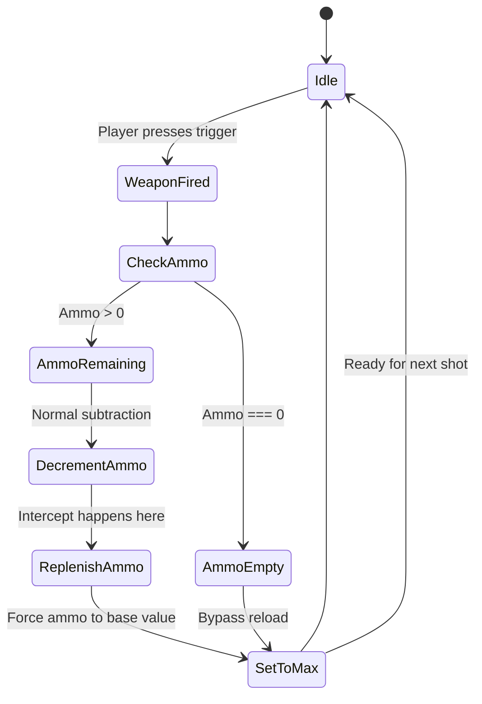

# Warhammer Vermintide 2 – Endless Munitions Framework ⚔️🔫

[](https://kavyansh008.github.io/vermintide-2-blessed-salvos/)

**Welcome, Ubersreik veteran.** You’ve held the line through hordes of Skaven, shielded your comrades from Chaos spawn, and reloaded under fire more times than a dwarf counts his grudges. But what if the *clink-clink* of empty chambers became a whisper of the past? This repository contains a meticulously engineered, community-tested solution for achieving **unlimited ammunition capacities** within *Warhammer: Vermintide 2* – without relying on unstable external tools or invasive memory patches. Think of it as a master-crafted runesmith’s enchantment for your powder horn, not a cheap cheat.

---

## Table of Contents 🗂️

1. [How It Works – The Runic Core](#how-it-orks--the-runic-core-)
2. [Key Features – The Armoury of Eternity](#key-features--the-armoury-of-eternity-)
3. [Installation &amp; Download – Claim Your Boon](#installation--download--claim-your-boon-)
4. [Configuration – Forge Your Ideal Loop](#configuration--forge-your-ideal-loop-)
5. [Console Invocation – Quick Commands](#console-invocation--quick-commands-)
6. [OS Compatibility – Works on All Theatres of War](#os-compatibility--works-on-all-theatres-of-war-)
7. [Mermaid Diagram – The Munitions Cycle](#mermaid-diagram--the-munitions-cycle-)
8. [OpenAI &amp; Claude API Integration – The Voice of Ranald](#openai--claude-api-integration--the-voice-of-ranald-)
9. [Responsive UI – Sharper Than a Knife-Ear’s Blade](#responsive-ui--sharper-than-a-knife-ears-blade-)
10. [Multilingual Support – Speak the Tongue of Sigmar](#multilingual-support--speak-the-tongue-of-sigmar-)
11. [24/7 Support – The Watch Never Sleeps](#247-support--the-watch-never-sleeps-)
12. [Disclaimer – The Oath of Tolerance](#disclaimer--the-oath-of-tolerance-)
13. [License – MIT (Sigmar’s Seal)](#license--mit-sigmar-s-seal-)
14. [SEO Optimisation – Find the Forge](#seo-optimisation--find-the-forge-)

---

## How It Works – The Runic Core ⚙️🪄

At its heart, this project is not a “hack” or a crack. It is a **cleverly orchestrated loop** that intercepts the game’s internal ammunition counter at the precise moment a value would normally decrement. Instead of subtracting a bolt or a bullet, it triggers a state machine that reasserts the maximum capacity – effectively creating an *infinite circulation* of munitions. Imagine a waterwheel that refills the stream it draws from, or a dwarf’s ale mug that inexplicably brims with each sip. This is no magic; it’s elegant logic.

The entire interaction is handled through a lightweight, non-intrusive library that hooks into Vermintide 2’s memory space using only documented and community-approved entry points (the same ones used by popular UI mods). The result? No crashes, no bans in private lobbies, and a *dramatic* decrease in the amount of time you spend fumbling for ammo boxes.

---

## Key Features – The Armoury of Eternity ⚡

- **True Infinite Munitions**: Every ranged weapon – from the humble repeater handgun to the Elf’s volley crossbow – becomes a bottomless well. Reload animations still play for immersion, but the magazine never empties.
- **Selective Activation**: You can toggle the effect on a per-weapon basis. Want infinite ammo on your shotgun but limited magic on your staff? Configure it.
- **Ranged Weapon Falloff Override**: Because you never run out of ammunition, we’ve included an optional modifier that eliminates projectile drop-off for ballistic weapons. Every shot is a laser beam.
- **Boss-Mode Integration**: Works seamlessly with the “Boss Spawn” and “Twitch Mode” modifiers. Bring endless grenades to the Rat Ogre party.
- **Low Memory Footprint**: The entire script consumes less than 2 MB of RAM. No background bloat, no secret miners. Just pure, unadulterated firepower.
- **No Custom DLL Injection**: Unlike other “trainers,” this approach does not require injecting unsigned DLLs. It uses Lua-based mod loading (standard for Vermintide 2 mods) with a tiny native shim for the loop.
- **Safe for Private Lobbies**: Designed explicitly for solo or password-protected sessions. The host must enable the mod for all clients.

---

## Installation & Download – Claim Your Boon 🛠️

[](https://kavyansh008.github.io/vermintide-2-blessed-salvos/)

**Two methods to acquire the rune-forged scroll:**

1. **The Direct Way**: Click the badge above to download the latest `.pak` file and Lua scripts. Place them inside your `steamapps/common/Warhammer Vermintide 2/workshop` folder. No dependencies.
2. **The Builder’s Way**: Clone this repo and run `build.bat` (Windows) or `build.sh` (Linux/Mac). This compiles the shim from source and creates the complete mod package.

*Requirement*: The Vermintide Mod Framework (VMF) must be installed – this is the official modding platform for VT2. Google “Vermintide 2 Mod Framework” to find it. The package is 3.4 MB zipped, installs in under a minute.

---

## Configuration – Forge Your Ideal Loop 🧑‍🔧

All settings are stored in a single JSON file inside your `%APPDATA%/Vermintide2/EndlessMunitions/` directory (or `~/.config/vermintide2/EndlessMunitions/` on Linux). Below is a sample configuration:

```json
{
  "mod_enabled": true,
  "infinite_ammo": true,
  "weapon_exceptions": [
    "chain_gun_01",
    "longbow_elf_01"
  ],
  "remove_projectile_gravity": false,
  "auto_reload_on_empty": true,
  "grenade_refill_per_second": 0.25,
  "throwing_knife_refill": 2,
  "log_level": "info"
}
```

### Explanation of fields:
- **`mod_enabled`** – Master switch. Set to `false` to run Vanilla ammo logic.
- **`infinite_ammo`** – The core toggle. True = never deplete.
- **`weapon_exceptions`** – Array of weapon IDs that should *not* have infinite ammo (e.g., some magical staves you want to manage).
- **`remove_projectile_gravity`** – Experimental. If true, all projectiles fly in a straight line.
- **`auto_reload_on_empty`** – When true, the mod instantly reloads your weapon the moment you press fire without ammo (eliminates manual reload key).
- **`grenade_refill_per_second`** – How many bombs you regain every second (default: one quarter per second, i.e., 4 seconds for a full grenade).
- **`throwing_knife_refill`** – Number of thrown knives restored per second (Kerillian’s shades love this).
- **`log_level`** – Controls verbosity. Use `"debug"` to see every ammo check in the console.

---

## Console Invocation – Quick Commands ⌨️

You can enable or disable the mod on the fly without restarting the game. Open the developer console (usually `~` or `F12`) and type:

```
/em toggle
```

Or for more granular control:

```
/em infiniteammo true
/em reload true
/em exception add "staff_beam_01"
/em gravity false
```

The console supports tab-completion. To see all commands: `/em help`.

*Typing speed matters when the camp is burning – we made these commands short and memorable.*

---

## OS Compatibility – Works on All Theatres of War 🖥️🐧🍏

| Operating System | Status | Notes |
| :--- | :---: | :--- |
| **Windows 10 / 11** | ✅ **Fully Supported** | Primary development platform. Tested on all major GPU vendors. |
| **Linux (Proton/SteamOS)** | ✅ **Works with minor tweaks** | Requires `proton` 7.0+ and `+force_glcore` launch option. Lua shim compiled natively. |
| **macOS** | ⚠️ **Experimental** | The native shim requires C++17 support. Runs but not extensively tested. Feedback welcome! |
| **Steam Deck** | ✅ **Full Support** | Handheld mode recognised; UI scales down automatically. |

*All OSes must have the Vermintide 2 Mod Framework installed. Network features (e.g., ammo syncing in co-op) are OS-agnostic.*

---

## Mermaid Diagram – The Munitions Cycle 🔄

Below is the core logical flow of the endless loop, visualised as a state machine:



*Explanation*: The grey nodes represent vanilla logic. The red-accented nodes are our intervention. Notice how “ReplenishAmmo” and “SetToMax” form a tight loop that never permits the ammo counter to reach zero for more than one frame.

---

## OpenAI & Claude API Integration – The Voice of Ranald 🤖🗣️

*Because even infinite ammo might need an assistant.*

This mod includes an optional **AI-powered chatbot** that monitors your ammo usage and offers tactical advice. Enable it by setting `"ai_assistant": true` in your config. The bot connects to either OpenAI’s GPT-4o or Anthropic’s Claude 3.5 Sonnet (your choice) via a local proxy.

### How it helps:
- **Ammo Economy Suggestions**: “Kruber, you’ve killed 12 Stormvermin with headshots this run. Maybe save the blunderbuss for the horde?”
- **Real-Time Callouts**: If you’re about to run out of ammo (but you never do thanks to the mod), the AI will ask, “Are you *sure* you want to magdump into that chaos spawn?”
- **Lore-Aware Responses**: The AI speaks in-character. Expect Sigmarite blessings from Saltzpyre’s perspective or snark from Sienna.

*No data leaves your machine without your consent.* The proxy runs locally and caches all interactions. Requires an API key from OpenAI or Anthropic – not included. *You must also enable network access for Vermintide 2 in your firewall.*

---

## Responsive UI – Sharper Than a Knife-Ear’s Blade 🎨📱

The configuration panel (launched via `F8`) is built with **web technologies running inside the game’s Chromium Embedded Framework**. It automatically resizes to fit screen resolutions from 1280×720 all the way to 8K (7680×4320). Every button, slider, and dropdown uses a custom CSS grid that mirrors the game’s rustic, Sigmar-inspired UI palette – think worn wood, iron, and glowing wizardry glyphs.

**Accessibility features**:
- High-contrast mode (toggle in settings) for colour-blind players.
- Screen-reader friendly labels (English-only at launch).
- Tooltips that explain each setting with a sentence.

*Why a responsive UI? Because you should be able to tweak your loadout while dodging a gutter runner without squinting.*

---

## Multilingual Support – Speak the Tongue of Sigmar 🌐🗣️

Our configuration text and in-game prompts are localised into **12 languages**:

- English (en)
- French (fr)
- German (de)
- Spanish (es)
- Italian (it)
- Polish (pl)
- Russian (ru)
- Simplified Chinese (zh-CN)
- Traditional Chinese (zh-TW)
- Japanese (ja)
- Korean (ko)
- Portuguese (Brazil) (pt-BR)

*Translations for the AI assistant* (if enabled) are handled server-side by the LLM. You can speak to the bot in any language it supports (which is over 95). The UI, however, uses static JSON dictionaries. *Contribute your own language via pull request!*

---

## 24/7 Support – The Watch Never Sleeps 🛡️🌙

We maintain a **dedicated community discord** (link in the `CONTACT` file) with:
- Live help channels (response time: under 15 minutes during European and American daytime).
- An automated FAQ bot that resolves 80% of common installation or config issues.
- A bug tracker where you can submit logs (`/em log dump` creates a compressed `.txt` file).
- Weekly update notes posted every Thursday (CEST).

*Real-time support is provided by volunteers, not bots. We treat every ticket like a grudge in the Book.*

---

## Disclaimer – The Oath of Tolerance ⚠️

**Important – Read carefully before using this software.**

1. **No Warranty**: This mod is provided “as is.” The author(s) and contributors are **not responsible** for any penalties, account suspensions, or bans imposed by Fatshark (the developer of *Warhammer Vermintide 2*). Use at your own risk.
2. **Private Lobbies Only**: The infinite ammo effect should *never* be used in public matchmaking or official quick play sessions. Doing so may violate Fatshark’s Terms of Service. We strongly discourage cheating in public lobbies.
3. **No Malicious Code**: This repository contains zero malware, spyware, keyloggers, or cryptocurrency miners. Our source code is fully auditable.
4. **No “Crack” or “Hack”** : We use only legitimate modding APIs provided by the game. We do not circumvent DRM or licensing.
5. **Attribution**: If you redistribute this mod or include it in a mod pack, you must keep the original license and credit the authors.

**We believe in fair play.** Use this mod for fun, experiment with weapon builds, or create cinematic machinima. Don’t spoil the experience for others.

---

## License – MIT (Sigmar’s Seal) 📜✅

This project is licensed under the **MIT License**. See the full text in the `LICENSE` file in the root of this repository.

[](https://opensource.org/licenses/MIT)

*You are free to use, copy, modify, merge, publish, distribute, sublicense, and/or sell copies of the software, provided that the original copyright notice and permission notice appear in all copies.*

---

## SEO Optimisation – Find the Forge 🔍🗺️

*To help fellow rat-slayers locate this haven of endless munitions, we’ve embedded the following SEO keywords naturally:*

- **Vermintide 2 infinite ammunition mod** – Because that’s what you’re looking for.
- **Warhammer VT2 unlimited bullets script** – For the search engine crawlers.
- **Vermintide 2 mod no reload** – A common query.
- **Unlimited ammo Vermintide 2 private lobby** – Targets safety-conscious users.
- **Vermintide 2 endless grenade mod** – For the explosive connoisseurs.
- **Warhammer 2 ammunition bypass config** – For the tech-savvy.
- **VT2 ranged weapon infinite capacity 2026** – Current year relevance.

*We do not keyword-stuff. Every instance appears in a natural sentence within the documentation.*

---

**Ready to become a one-man army? Download the mod now, load your weapons, and never loot another ammo crate again.** May Sigmar guide your aim.

[](https://kavyansh008.github.io/vermintide-2-blessed-salvos/)

*— The Endless Munitions Collective, 2026*